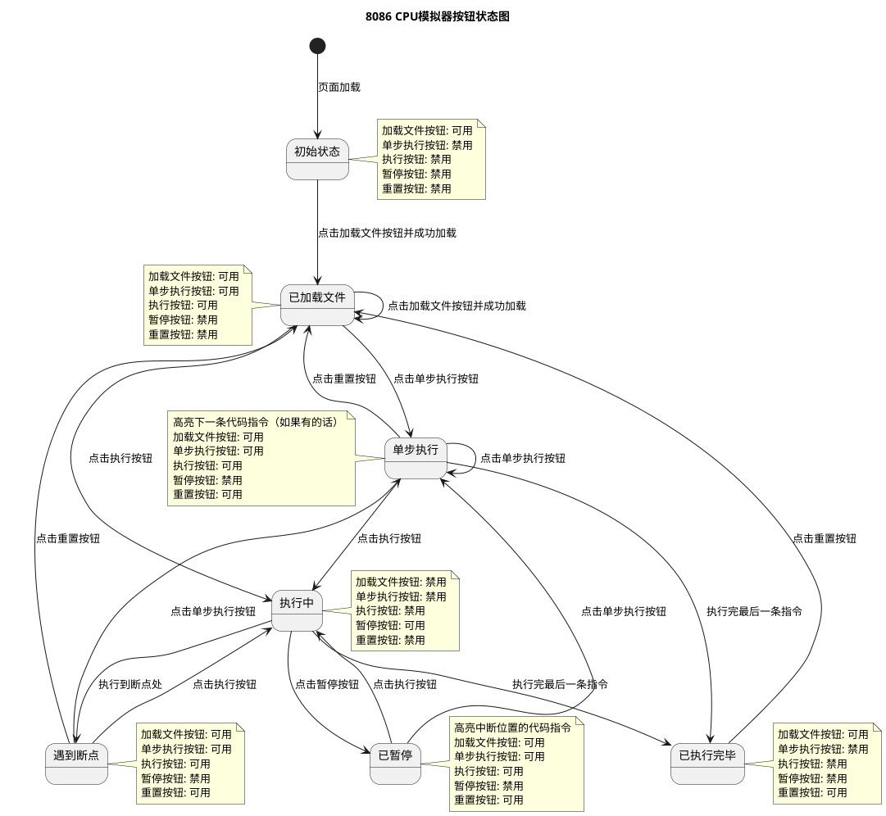

```plantuml
@startuml
title 8086 CPU模拟器按钮状态图

[*] --> 初始状态: 页面加载
初始状态 --> 已加载文件: 点击加载文件按钮并成功加载

已加载文件 --> 已加载文件: 点击加载文件按钮并成功加载
已加载文件 --> 单步执行: 点击单步执行按钮
已加载文件 --> 执行中: 点击执行按钮

单步执行 --> 单步执行: 点击单步执行按钮
单步执行 --> 执行中: 点击执行按钮
单步执行 --> 已执行完毕: 执行完最后一条指令
单步执行 --> 已加载文件: 点击重置按钮

执行中 --> 已暂停: 点击暂停按钮
执行中 --> 已执行完毕: 执行完最后一条指令
执行中 --> 遇到断点: 执行到断点处

已暂停 --> 执行中: 点击执行按钮
已暂停 --> 单步执行: 点击单步执行按钮
已执行完毕 --> 已加载文件: 点击重置按钮

遇到断点 --> 执行中: 点击执行按钮
遇到断点 --> 单步执行: 点击单步执行按钮
遇到断点 -->已加载文件: 点击重置按钮

note right of 初始状态 {
  加载文件按钮: 可用
  单步执行按钮: 禁用
  执行按钮: 禁用
  暂停按钮: 禁用
  重置按钮: 禁用
}

note left of 已加载文件 {
  加载文件按钮: 可用
  单步执行按钮: 可用
  执行按钮: 可用
  暂停按钮: 禁用
  重置按钮: 禁用
}

note left of 单步执行 {
  高亮下一条代码指令（如果有的话）
  加载文件按钮: 可用
  单步执行按钮: 可用
  执行按钮: 可用
  暂停按钮: 禁用
  重置按钮: 可用
}

note right of 执行中 {
  加载文件按钮: 禁用
  单步执行按钮: 禁用
  执行按钮: 禁用
  暂停按钮: 可用
  重置按钮: 禁用
}

note right of 已暂停 {
  高亮中断位置的代码指令
  加载文件按钮: 可用
  单步执行按钮: 可用
  执行按钮: 可用
  暂停按钮: 禁用
  重置按钮: 可用
}

note right of 已执行完毕 {
  加载文件按钮: 可用
  单步执行按钮: 禁用
  执行按钮: 禁用
  暂停按钮: 禁用
  重置按钮: 可用
}

note right of 遇到断点 {
  加载文件按钮: 可用
  单步执行按钮: 可用
  执行按钮: 可用
  暂停按钮: 禁用
  重置按钮: 可用
}

@enduml
```